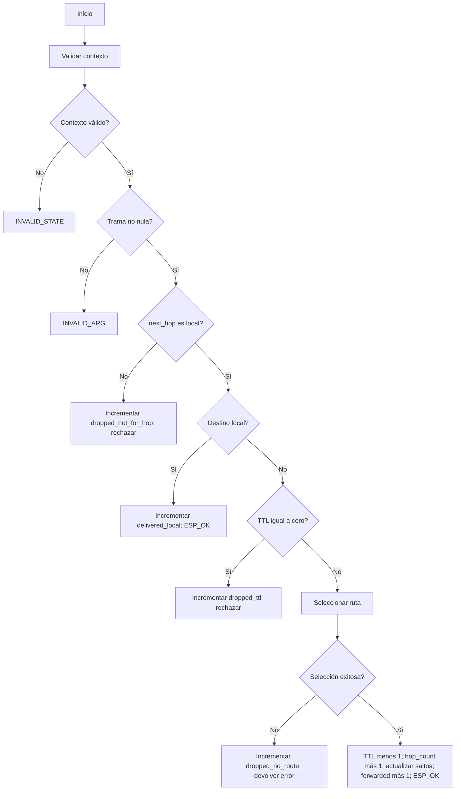

# Generación de casos mediante Control Flow Test

## Objeto y criterio

Objeto: `network_layer_prepare_forward()` en `firmware/components/network_layer/network_layer.c`.

Se elige CFT de profundidad 1 para cubrir las acciones posteriores a las decisiones del flujo principal. La validación interna y la selección de ruta se tratan como acciones llamadas; el detalle de sus condiciones internas queda para casos adicionales. Se agregan TTL 1 y una entrega local con TTL 0 para comprobar límites y precedencia.

Los caminos lógicos se convierten en entradas físicas y un resultado esperado derivado de RT-01 a RT-09. Los tests anteriores se aprovechan como punto de partida, pero la tabla define casos que deben implementarse y ejecutarse con Ceedling.

## Diagrama del flujo

## Caminos lógicos

| Camino | Decisiones recorridas | Acción final |
|---|---|---|
| P1 | D1=no | E1 |
| P2 | D1=sí, D2=no | E2 |
| P3 | D1=sí, D2=sí, D3=no | E3 |
| P4 | D1=sí, D2=sí, D3=sí, D4=sí | L |
| P5 | D1=sí, D2=sí, D3=sí, D4=no, D5=sí | E5 |
| P6 | D1=sí, D2=sí, D3=sí, D4=no, D5=no, D6=no | E6 |
| P7 | D1=sí, D2=sí, D3=sí, D4=no, D5=no, D6=sí | F |

Resultado del diseño: 7 caminos lógicos y 9 casos físicos iniciales, porque P1 y P7 se prueban con dos variantes. Eso supera las tres o cuatro pruebas orientativas mencionadas por el profesor sin aumentar demasiado el alcance.

## Fixture base

Crear contexto nuevo para cada test: `local_addr=2`, `default_ttl=4`, contadores cero. Inicializar con `network_layer_init()`.

Trama base: `DATA_BEST_EFFORT`, `src_addr=1`, `dst_addr=3`, `prev_hop=1`, `next_hop=2`, `msg_id=99`, `ttl=2`, `hop_count=0`, payload de cuatro bytes `{0x10,0x20,0x30,0x40}` y longitud 4.

Cuando se indica ruta presente, cargar mediante `network_layer_upsert_route()` una ruta `dst=3`, `next_hop=3`, `hop_count=1`, entrega 1000, RSSI -15, SNR 14 y `updated_ms=1000`. Comprobar que la preparación del fixture devolvió `ESP_OK`.

## Casos físicos comprometidos

| ID | Camino | Cambio al fixture | Resultado esperado | Requerimiento |
|---|---|---|---|---|
| CP-01 | P1 | Contexto NULL; trama válida | `ESP_ERR_INVALID_STATE`; trama conservada | RT-01 |
| CP-02 | P1 | Contexto con `initialized=false`; trama válida | `ESP_ERR_INVALID_STATE`; trama y contadores conservados | RT-01 |
| CP-03 | P2 | Contexto válido; trama NULL | `ESP_ERR_INVALID_ARG`; contadores conservados | RT-02 |
| CP-04 | P3 | `next_hop=4` | `NETWORK_LAYER_ERR_NOT_FOR_LOCAL_HOP`; solo `dropped_not_for_hop=1` | RT-03 |
| CP-05 | P4 | `dst_addr=2`, `ttl=0`; sin ruta | `ESP_OK`; solo `delivered_local=1`; TTL y demás campos conservados | RT-04 |
| CP-06 | P5 | `ttl=0`; ruta presente | `NETWORK_LAYER_ERR_TTL_EXPIRED`; solo `dropped_ttl=1` | RT-05 |
| CP-07 | P6 | TTL 2; sin ruta | `NETWORK_LAYER_ERR_NO_ROUTE`; solo `dropped_no_route=1` | RT-06 |
| CP-08 | P7 | TTL 2; ruta presente | `ESP_OK`; TTL 1, hop_count 1, prev_hop 2, next_hop 3; solo `forwarded=1` | RT-07, RT-08 |
| CP-09 | P7 | TTL 1; ruta presente | `ESP_OK`; TTL 0, hop_count 1, prev_hop 2, next_hop 3; solo `forwarded=1` | RT-07, RT-08, RT-09 |

Para CP-04 a CP-07 comprobar que la trama no cambió. Para CP-08 y CP-09 verificar explícitamente tipo, origen, destino, identificador, longitud y cada byte de payload. En todos los casos con contexto accesible comprobar los seis contadores, no solo el que debe aumentar. Comparar campos semánticos; no depender de padding de structs mediante una comparación cruda de memoria.

## Integración opcional IS-01

Crear tres contextos locales 1, 2 y 3. Cargar ruta en sensor hacia 3 vía 2 y en puente hacia 3 vía 3. Originar la trama en sensor con TTL 4; serializar/deserializar mediante `mesh_frame`; reenviar en puente; serializar/deserializar nuevamente y llamar a preparación en concentrador para verificar entrega local.

Esperar: TTL 3, hop_count 1, origen 1, destino 3, payload idéntico; `originated=1` en sensor, `forwarded=1` en puente y `delivered_local=1` en concentrador. Un puente intermedio equivale a hop_count 1 en esta implementación, aunque el recorrido use dos enlaces de radio.

Este caso prueba integración de software. No usa radio ni simula propagación, pérdidas RF o latencia física. Mantener su resultado separado de la cobertura de la suite unitaria.
